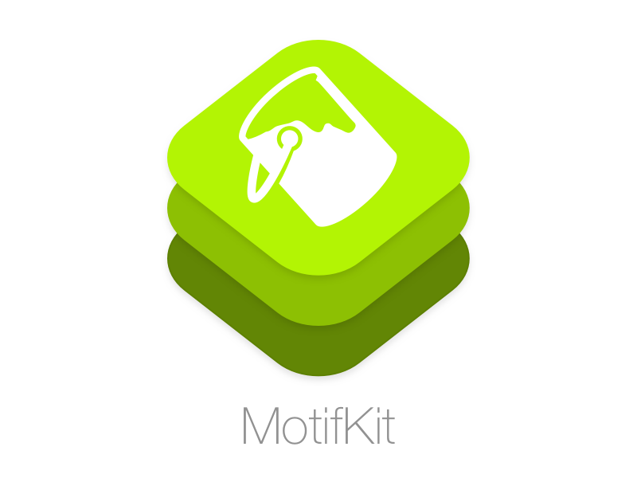

<p align="center">
    
    <a href="https://developer.apple.com/swift"></a>
    <a href="https://github.com/Carthage/Carthage"></a>
    
</p>

<p align="center">
    <a href="#installation">Installation</a>
  • <a href="https://github.com/refractaldev/Motif/issues">Issues</a>
  • <a href="#license">License</a>
</p>

Motif is a lightweight way to handle, reload and centralise all of your Colors, Fonts and more.

```swift
struct SomeTheme: MotifTheme {
    let classes: [MotifClass] = [SomeMenu()]
    
    struct SomeMenu: MotifClass {
        let TextColor = UIColor.greenColor()
    }
}

Motif.addTheme(SomeTheme())

... later ...

class SomeMenu {

	let someView = SomeView(...)

	Motif.setColor("TextColor", target: someView, variable: "textColor")
	
	// someView's textColor should now be Green
}

... later ...

Motif.setTheme("NewTheme")

// someView's textColor variable now equals NewTheme's TextColor

```

You can store:
* [x] Colors
* [x] Fonts
* [x] Arrays of attributes 
* [x] Strings
* [x] Any object (With some manual labor)

## Compatibility

Motif requires iOS 8+ and is compatible with **Swift 2** projects. Objective-C support is unlikely.

## Installation

Installation for [Carthage](https://github.com/Carthage/Carthage) is extremely simple:

`github "refractaldev/Motif" ~> 0.7`

As for [CocoaPods](https://cocoapods.org), we currently don't support the platform. 
However, any Pull Requests adding support will be gladly accepted.

## Usage

### Basic setup
Pantry provides serialization of most basic UI customisation types (`UIColor`, `UIFont`, `[String: AnyObject]`) with no setup. You can use it to create a theme for your app like this:

```swift
struct DarkTheme: MotifTheme {
    let classes: [MotifClass] = [Default(), SomeMenu()]
    
    // Optionally, you can setup a Default class which variables can fallback to
    struct Default: MotifClass {
    	let TextColor = UIColor.darkGrayColor()
    	let ThemeDescription: String = "This is a description for our theme, it could be shown in a setting view."
    }
    
    struct SomeMenu: MotifClass {
        let TextColor = UIColor.lightGrayColor()
        let TextFont = UIFont(name: "Avenir", size: 1)!
        let TextAttributes: [String: AnyObject] = [
            NSStrikethroughStyleAttributeName: 1
        ]
    }
}

Motif.addTheme(DarkTheme())
```

You can then apply attributes from your newly created theme to a view or group of views like this:

```swift
	// Apply to a single object
	Motif.setColor(
		testLabel!, 
		variable: "textColor",
		key: "TextColor"
	)
	
	// Apply to a group of objects
	Motif.setFont(
		[testLabel1!, textLabel2!],
		variable: "textColor",
		key: "TextColor",
		size: 20
	)

	// Apply to an object using a completion handler
	Motif.setAttributes("TextAttributes", completion: { attributes in
            self.testLabel!.attributedText = NSAttributedString(string: "This is a test", attributes: attributes)
    })
    
    //Want to load a custom attribute? You can do that too..
    Motif.setObject(String.self, key: "ThemeDescription", completion: { string in
    	print(string)
    })
```


### Automagic Theme Swapping
Let's say we've now added a second theme, called LightTheme, with a new set of colors, fonts and even attributes. How do we set all our variables to this new theme's definitions?

Simple: One line of code.

```swift
Motif.setTheme("LightTheme")
```

It's literally that easy.

Just set the new theme, and all your UI using the theme's attributes should automagically reload to match your new selection, just like that.

## License

Motif uses the MIT license. Please file an issue if you have any questions or if you'd like to share how you're using this tool.

## Attribution

Motif "paint can icon" by [Drew Ellis from the Noun Project](https://thenounproject.com/term/paint-can/6073/)